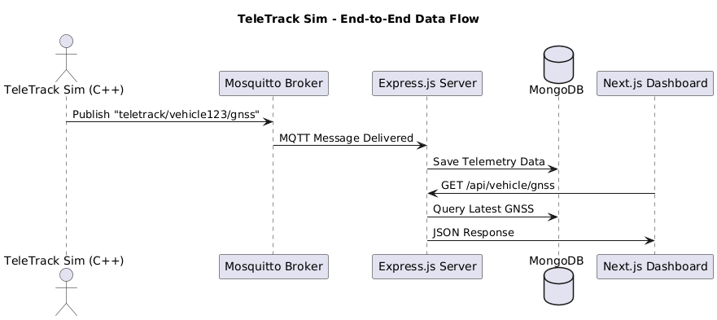

# TeleTrack Sim — Vehicle Telemetry Simulation Platform

> Note <br>
> Although This project is guided by AI, the idea originates from my own quest to peel apart and understand different technologies I am curious about.As such, it is a spiritual transmutation of my inquisitiveness to work on cars and my childhood dream of being a car mechanic

A modular, MQTT-driven vehicle telemetry platform built using modern C++, an Express.js backend, and a Next.js frontend. Designed for real-time data simulation, backend processing, and live visualization.

## What Are We Building?

We are developing a complete telemetry pipeline where:

1. A **C++ application (`teletrack_sim`)** simulates a vehicle.
2. It **publishes MQTT telemetry messages** (GNSS, engine data, speed, etc.) to a local MQTT broker.
3. An **Express.js backend** subscribes to those messages, processes them, stores the data in a database, and exposes a REST API.
4. A **Next.js frontend** fetches this data and renders a real-time vehicle dashboard.

This simulates a real-world IoT pipeline used in fleet tracking and connected vehicle systems.

## System Architecture

```
┌────────────────────┐
│ TeleTrack Sim (C++)│
│ MQTT Publisher      │
└─────────┬──────────┘
          │
          ▼
┌────────────────────┐
│ MQTT Broker         │
│ (Mosquitto Docker)  │
└─────────┬──────────┘
          │
          ▼
┌────────────────────┐
│ Backend Server      │
│ (Express.js + DB)   │
└─────────┬──────────┘
          │
          ▼
┌────────────────────┐
│ Frontend Dashboard  │
│ (Next.js App)       │
└────────────────────┘
```

## Folder Structure

```
teletrack-sim-project/
│
├── teletrack_sim/             # C++ MQTT publisher
│   └── modules/
│   └── CMakeLists.txt
│
├── mqtt-broker/               # Mosquitto config (Dockerized)
│   └── mosquitto.conf
│
├── backend-server/            # Express.js + MQTT + DB
│   └── src/
│   └── package.json
│
├── frontend-dashboard/        # Next.js UI
│   └── pages/
│   └── public/
│
└── docker-compose.yml         # Mosquitto + MongoDB stack
```

## MQTT Topics

| Topic                         | Sample Payload                     |
| ----------------------------- | ---------------------------------- |
| `teletrack/vehicle123/gnss`   | `{ "lat": 1.352, "lon": 103.819 }` |
| `teletrack/vehicle123/speed`  | `{ "speed": 80 }`                  |
| `teletrack/vehicle123/engine` | `{ "rpm": 3000, "temp": 95 }`      |

## UML: Data Flow Sequence



## Technology Stack

| Layer     | Technology                     |
| --------- | ------------------------------ |
| Simulator | C++ with Paho MQTT C/C++       |
| Messaging | Mosquitto (Docker MQTT broker) |
| Backend   | Node.js + Express.js + mqtt.js |
| Database  | MongoDB or PostgreSQL          |
| Frontend  | Next.js + Tailwind CSS         |
| Tooling   | CMake, Conan, Docker Compose   |

## Development Plan (Phase-Based)

The following phased roadmap is designed for sustainable learning and development, especially for individuals managing a full-time job, graduate studies, and ongoing AI/C++ skill building.

### Phase 1: GNSS Simulation and MQTT Publishing

**Objective:** Simulate vehicle GNSS data in `teletrack_sim` and publish it to a local MQTT broker.

- Set up `teletrack_sim` C++ project using CMake
- Integrate Paho MQTT C++ client
- Generate mock GNSS data as JSON
- Connect and publish to local Mosquitto broker on topic `teletrack/vehicle123/gnss`
- Verify output using `mosquitto_sub` or MQTT Explorer

### Phase 2: Express.js Backend and Database Storage

**Objective:** Receive MQTT data and store it in a local MongoDB database.

- Initialize Express.js backend
- Use `mqtt.js` to subscribe to `teletrack/#`
- Parse incoming payloads and store them in MongoDB
- Add REST endpoint to fetch latest telemetry: `GET /api/vehicle/:id/gnss`
- Test with simulated MQTT messages

### Phase 3: Next.js Frontend Dashboard

**Objective:** Build a UI that fetches and displays vehicle telemetry.

- Create Next.js app and style with Tailwind CSS
- Build `/dashboard` page
- Fetch GNSS data from backend
- Display coordinates and vehicle data on UI
- Optionally add Leaflet for maps and Chart.js for metrics

### Phase 4: Full Integration and Realtime Behavior

**Objective:** Connect all components and enhance the user experience.

- Connect `teletrack_sim` to publish real data in near real-time
- Wire backend subscriber to handle dynamic topics and DB writes
- Fetch and display updated data in frontend
- Optionally integrate WebSockets or polling for live updates

## Optional: Docker Compose Example

```yaml
version: "3"
services:
  mosquitto:
    image: eclipse-mosquitto
    ports:
      - "1883:1883"
      - "9001:9001"

  mongo:
    image: mongo
    ports:
      - "27017:27017"
```

## Future Extensions

| Feature               | Approach                                         |
| --------------------- | ------------------------------------------------ |
| Cloud MQTT            | Replace broker with AWS IoT or Azure IoT Hub     |
| Secure Auth           | Use JWT / OAuth with Auth0 or Firebase           |
| Visualization         | Add Grafana or custom charts                     |
| Historic Analysis     | Add time-series DB (e.g., InfluxDB, TimescaleDB) |
| Multi-Vehicle Support | Parameterize topic and API per vehicle ID        |
|                       |                                                  |

| Concept | Note | Link |
| ------- | ---- | ---- |
|         |      |      |
|         |      |      |

| Advantages | Disadvantages |
| ---------- | ------------- |
|            |               |

## Note
